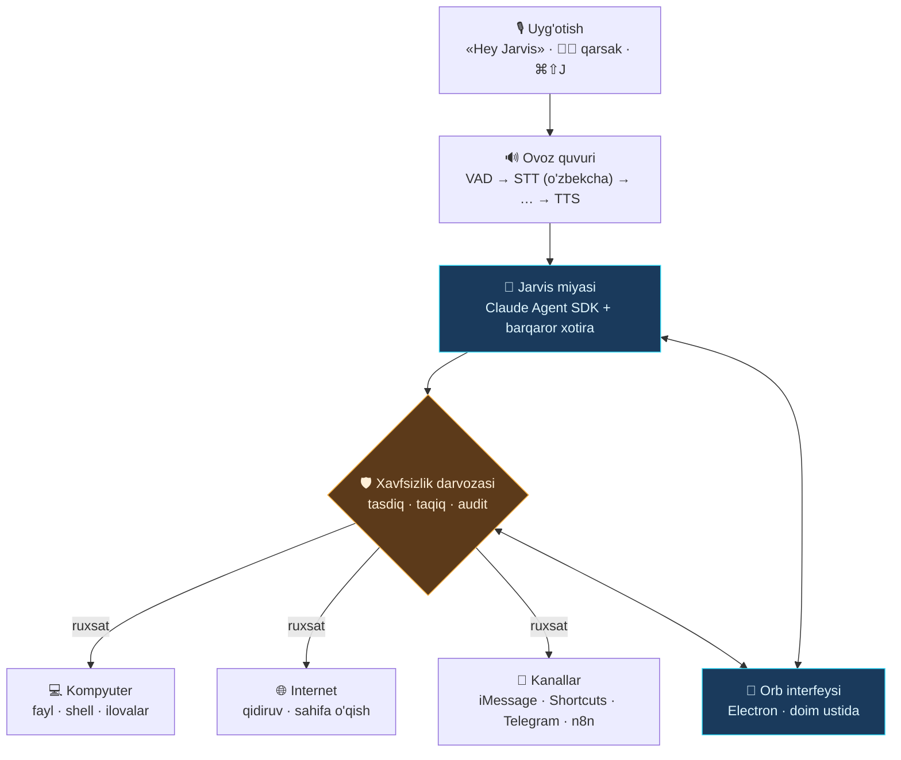

# Jarvis

Ovoz bilan boshqariladigan shaxsiy AI yordamchi — **o'zbek tilida**, macOS uchun.

«Hey Jarvis» deysiz yoki ikki marta qarsak chalasiz — ekranda dumaloq orb yonadi,
Jarvis sizni tinglaydi va kompyuterda ish bajaradi. Telegram bot emas, chat oynasi
emas — Siri kabi, lekin butunlay sizniki va kompyuteringizni haqiqatan boshqaradi.



## Nima qila oladi

- **Ovoz bilan uyg'onadi** — «Hey Jarvis», ikki marta qarsak, yoki `⌘⇧J`.
- **O'zbekcha gapiradi va tushunadi** — savol ham, javob ham o'zbek tilida.
- **Kompyuterni boshqaradi** — fayl o'qiydi/yozadi, shell buyruqlarini bajaradi,
  ilovalarni ochadi, kod yozadi, loyihani davom ettiradi.
- **Eslab qoladi** — afzalliklaringiz va loyiha holati suhbatlar orasida saqlanadi.
- **Telefoningizga yetib boradi** — iMessage/SMS yuboradi, macOS Shortcuts orqali
  iPhone'da amal bajaradi.
- **Xabar beradi** — uzoq ish tugaganda Telegram yoki bildirishnoma yuboradi.
- **Har bir xavfli amal uchun so'raydi** — orb'da ✅/❌ chiqadi, hammasi jurnalga yoziladi.

## Tez boshlash

```bash
git clone https://github.com/kamolbeek/jarvis-assistant.git
cd jarvis-assistant
./scripts/install.sh
```

Keyin `.env` faylini to'ldiring (kamida ikkita kalit):

```bash
ANTHROPIC_API_KEY=sk-ant-...      # miya
ELEVENLABS_API_KEY=...            # ovoz (STT + TTS)
```

macOS ruxsatlarini bering — **Tizim sozlamalari → Maxfiylik va xavfsizlik**:

| Ruxsat | Nima uchun |
| --- | --- |
| Mikrofon | uyg'otuvchi so'z va sizning gapingiz |
| Kirish imkoni (Accessibility) | global tugma, ilovalarni boshqarish |
| Avtomatlashtirish (Automation) | Messages, System Events |

Ishga tushiring:

```bash
./scripts/run.sh
```

Orb ekranning o'ng pastida paydo bo'ladi. «Hey Jarvis» deb ko'ring.

## O'zbek tili uchun ovoz: qaysi provayderni tanlash

Bu loyihaning eng nozik qismi — o'zbekcha sifat provayderdan provayderga
sezilarli farq qiladi. Shuning uchun provayderlar almashtiriladigan qilingan:
`config/jarvis.yaml` da bir qator o'zgartirsangiz kifoya.

| Provayder | STT | TTS | Izoh |
| --- | :---: | :---: | --- |
| **ElevenLabs** | ✅ Scribe | ✅ multilingual v2 | Standart tanlov. Bitta kalit bilan ikkalasi ham ishlaydi. |
| **Mohir.ai** (UzbekVoice) | ✅ | ✅ | Aynan o'zbek tiliga o'rgatilgan, mahalliy. Aksentda aniqroq bo'lishi mumkin. |
| **Azure Speech** | — | ✅ `uz-UZ-SardorNeural`, `uz-UZ-MadinaNeural` | Haqiqiy o'zbekcha neyron ovozlar. |
| **Whisper (lokal)** | ✅ | — | Internetsiz ishlaydi. Apple Silicon'da MLX orqali tez. |

**Tavsiya:** ElevenLabs bilan boshlang, keyin o'z ovozingizda uch variantni
solishtiring. Ovoz sifati — bu tizimda foydalanish tajribasini eng ko'p
belgilaydigan omil.

```yaml
# config/jarvis.yaml
voice:
  stt:
    provider: "mohir"          # elevenlabs | mohir | whisper_local
  tts:
    provider: "azure"          # elevenlabs | azure | mohir | macos
    voice: "uz-UZ-SardorNeural"
```

## Xavfsizlik — eng muhim qism

«Mensiz to'liq nazorat» — bu tizimning eng xavfli tomoni. Agent `rm -rf` yozsa
yoki ma'lumotlar bazasida noto'g'ri `UPDATE` bajarsa, uni kim to'xtatadi?

Shuning uchun har bir asbob chaqiruvi xavfsizlik darvozasidan o'tadi:

```yaml
safety:
  default: "ask"
  rules:
    Read: "allow"       # o'qish — qaytarib bo'ladi, so'ralmaydi
    Bash: "ask"         # shell — har safar tasdiq
    Write: "ask"        # fayl yozish — tasdiq
  forbidden_patterns:   # bular umuman bajarilmaydi
    - "rm -rf /"
    - "sudo rm"
  writable_roots:       # bulardan tashqariga yozib bo'lmaydi
    - "~/jarvis-workspace"
```

Uch qatlam:

1. **Taqiqlangan naqshlar** — tasdiq ham so'ralmaydi, shunchaki bajarilmaydi.
2. **Papka chegarasi** — ruxsat etilgan papkalardan tashqariga yozish bloklanadi
   (shell `>` yo'naltirishlari ham tekshiriladi).
3. **Tasdiq** — qolgan xavfli amallar orb'da ✅/❌ bo'lib chiqadi.

Hammasi `~/.jarvis/audit.log` ga yoziladi. **Boshidan to'liq erkinlik bermang** —
ishonch ortgan sari qoidalarni yumshating.

## Halol cheklovlar

Buni oldindan bilib qo'ying, keyin ko'ngil qolmasin:

**iPhone'ni to'liq boshqarib bo'lmaydi.** Apple ruxsat bermaydi. Shortcuts orqali
cheklangan ishlar mumkin (eslatma, xabar, joylashuv), lekin «telefonimni to'liq
boshqar» degani iOS'da yo'q. Android'da ADB va Tasker bilan ancha ko'p narsa mumkin.

**Kompyuter yoqiq bo'lishi kerak.** Jarvis lokal ishlaydi — uxlab qolgan mashinada
ishlamaydi. Doimiy ishlashi kerak bo'lgan ishlarni (kunlik hisobot, monitoring)
VPS'dagi n8n'ga o'tkazing va `call_n8n` orqali ulang.

**Ovoz kechikishi bor.** Uyg'onishdan javobgacha odatda 2–4 soniya: gapirish
tugashini kutish, STT, model, TTS. Javob gap-gap chiqariladi, shuning uchun
birinchi so'z tezroq eshitiladi — lekin bu Siri emas.

**O'zbekcha STT mukammal emas.** Texnik atamalar, ingliz so'zlari va tez gapirish
xatolarga olib keladi. Muhim buyruqlarni sekinroq va aniq ayting.

**Xarajat.** Claude API ishlatilishiga qarab ~$20–60/oy, ElevenLabs alohida.
`brain.max_budget_usd` bilan har bir suhbatga chegara qo'ying.

## Loyiha tuzilishi

```
jarvis/
├── audio/          mikrofon, uyg'otuvchi so'z, qarsak, gapirish tugashi (VAD)
├── voice/          STT va TTS provayderlari + ijro
├── brain/          Claude Agent SDK, xotira, tizim ko'rsatmasi
├── safety/         xavfsizlik darvozasi va audit
├── tools/          macOS, Shortcuts, Telegram, n8n asboblari
├── ui/             orb bilan WebSocket aloqasi
├── bus.py          hodisa shinasi (yadro ↔ orb)
└── __main__.py     asosiy sikl

ui/                 Electron orb: doim ustida turadigan suzuvchi interfeys
config/             sozlamalar
tests/              tashqi xizmatlarsiz ishlaydigan testlar
```

Testlar API kaliti va mikrofon talab qilmaydi:

```bash
python -m pytest tests/ -q
```

## Keyingi bosqichlar

- [ ] Uzluksiz suhbat rejimi — har safar «Hey Jarvis» demasdan davom ettirish
- [ ] Jarvis gapirayotganda uni bo'lish (barge-in)
- [ ] O'zbekcha uyg'otuvchi so'z modeli (hozir inglizcha «hey jarvis»)
- [ ] Brauzer boshqaruvi (Playwright)
- [ ] Vaqt bo'yicha ishga tushuvchi vazifalar (kunlik brief)
- [ ] Supabase orqali xotirani qurilmalar o'rtasida sinxronlash
