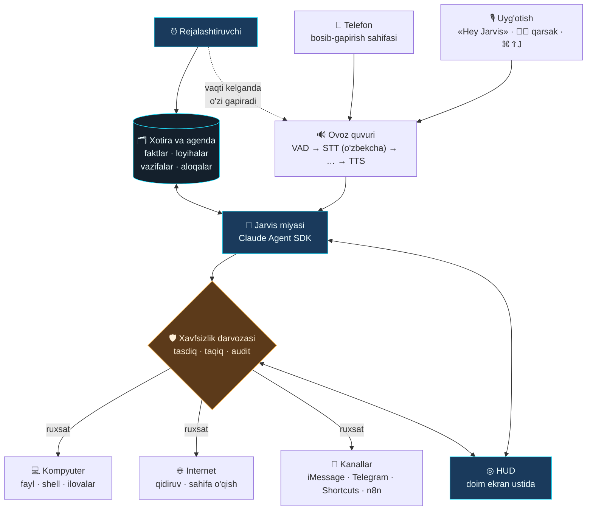

# Jarvis

Ovoz bilan boshqariladigan shaxsiy AI yordamchi — **o'zbek tilida**, macOS uchun.

«Hey Jarvis» deysiz yoki ikki marta qarsak chalasiz — ekranda HUD yonadi,
Jarvis sizni tinglaydi va kompyuterda ish bajaradi. Telegram bot emas, chat oynasi
emas — Siri kabi, lekin butunlay sizniki va kompyuteringizni haqiqatan boshqaradi.



## Nima qila oladi

- **Uch xil chaqiruv** — «Salom Jarvis», «Hi Jarvis», «Hey Jarvis». Yoki ikki
  marta qarsak, yoki `⌘⇧J`. Qarsak bilan chaqirsangiz «Buyrug'ingizni
  kutyapman» deydi.
- **Asosiy oyna chaqirilganda ochiladi** — qarsak yoki `⌘⇧J` bosilsa, to'liq
  ekranli HUD chiqadi. Lekin uyquda: ko'zlar o'chgan. **Gapirganingizda yonadi.**
- **Suhbatni davom ettiradi** — javobdan keyin tinglab turadi, har safar
  «Hey Jarvis» deyish shart emas.
- **Gapini bo'lish mumkin** — Jarvis gapirayotganda gapirsangiz, darhol jim
  bo'lib sizni tinglaydi. Uzun javobni oxirigacha kutish kerak emas.
- **O'zbekcha gapiradi va tushunadi** — savol ham, javob ham o'zbek tilida.
- **Kompyuterni boshqaradi** — fayl o'qiydi/yozadi, shell buyruqlarini bajaradi,
  ilovalarni ochadi, kod yozadi, loyihani davom ettiradi.
- **Loyihalaringizni yuritadi** — har bir loyihaning holati, keyingi qadami va
  muddati saqlanadi. «Loyihalarim qaysi bosqichda?» deb so'rasangiz, aytadi.
- **O'zi eslatadi** — «ertaga soat 10 da Alisher bilan uchrashuv» desangiz,
  ertaga soat 10 da **o'zi gapiradi**. So'rashingiz shart emas.
- **Ertalab kunni tushuntiradi** — belgilangan vaqtda bugungi ishlarni aytib beradi.
- **Sizning nomingizdan yozadi** — «Alisherga yoz, kechikaman de» desangiz,
  Telegram yoki SMS orqali yuboradi.
- **Telefonda ham ishlaydi** — telefon brauzeridan bosib-gapirish sahifasi.
- **Har bir xavfli amal uchun so'raydi** — HUD'da ✅/❌ chiqadi, hammasi jurnalga yoziladi.

## Tez boshlash

```bash
git clone https://github.com/kamolbeek/jarvis-assistant.git
cd jarvis-assistant
./scripts/install.sh
```

Keyin `.env` faylini to'ldiring:

```bash
ANTHROPIC_API_KEY=sk-ant-...      # miya
ELEVENLABS_API_KEY=...            # ovoz (STT + TTS)
```

### Nega kalit kerak — va qachon kerak emas

**Miya (Claude)** Anthropic serverlarida ishlaydi, kompyuteringizda emas — model
o'nlab gigabayt va kuchli videokarta talab qiladi. Shuning uchun kirish kaliti
kerak. Ikki yo'l bor:

1. **Claude Pro/Max obunasi** — agar obunangiz bo'lsa, **API uchun alohida
   to'lash shart emas**. Mac'da `claude` o'rnatib kiring (`claude` deb yozing,
   brauzerda tasdiqlang) va `.env` da `ANTHROPIC_API_KEY` ni **qo'ymang**.
   Claude Agent SDK ichida aynan Claude Code'ni ishlatadi, u esa obunangiz
   bilan kiradi — Jarvis o'sha tarif ichida ishlaydi.
2. **API kaliti** — obunangiz bo'lmasa, har so'rov uchun alohida to'lov
   ([console.anthropic.com](https://console.anthropic.com)).

> **Diqqat — ikki marta to'lash tuzog'i.** `.env` da kalit turgan bo'lsa, u
> obunadan **ustun** turadi: Jarvis obunani chetlab o'tib, API hisobidan
> pul yechadi. Obunangiz bor bo'lsa, kalit qatorini izohga aylantiring:
>
> ```bash
> sed -i '' 's|^ANTHROPIC_API_KEY=|# ANTHROPIC_API_KEY=|' .env
> ```
>
> `python -m jarvis doctor` qaysi yo'l ishlatilayotganini aytadi.

**Ovoz esa butunlay kompyuteringizda ishlashi mumkin** — kalitsiz, internetsiz,
bepul. `config/jarvis.yaml` da:

```yaml
voice:
  stt:
    provider: "whisper_local"     # Whisper Mac'ning o'zida ishlaydi
  tts:
    provider: "macos"             # macOS ning o'z ovozi
```

Kamchiligi — o'zbekcha aniqligi ElevenLabs'dan pastroq va birinchi ishga
tushirishda model yuklab olinadi (~1.5 GB). Lekin hech qanday to'lov yo'q.

**Eng yaxshi o'zbekcha — rubaiSTT (ham lokal, ham bepul).** Bu model aynan
o'zbek tiliga o'rgatilgan va whisper.cpp orqali ishlaydi:

```bash
brew install whisper-cpp
```

```yaml
voice:
  stt:
    provider: "rubai"             # = whisper_cpp
    # model ko'rsatilmasa, odatdagi joylardan o'zi qidiradi
    model: "~/Library/Application Support/uzbek-dictation/ggml-rubaistt_v2_medium-q8_0.bin"
```

Agar Mac'ingizda [RubaiSTT Dictation](https://github.com/MuhammadMirrr/uzbek-dictation)
ilovasi bo'lsa, model allaqachon yuklangan — Jarvis o'sha faylni ishlatadi,
ilovaning o'zini ochish shart emas. Modelni topish:

```bash
find ~ /Applications -iname "*.bin" -size +100M 2>/dev/null | head
```

macOS ruxsatlarini bering — **Tizim sozlamalari → Maxfiylik va xavfsizlik**:

| Ruxsat | Nima uchun |
| --- | --- |
| Mikrofon | uyg'otuvchi so'z va sizning gapingiz |
| Kirish imkoni (Accessibility) | global tugma, ilovalarni boshqarish |
| Avtomatlashtirish (Automation) | Messages, System Events |

**Ishga tushirishdan oldin — diagnostika.** Birinchi marta hamma narsa birdan
ishlashi kamdan-kam bo'ladi, shuning uchun har bir bo'g'inni alohida tekshiring:

```bash
source .venv/bin/activate
python -m jarvis doctor
```

Ketma-ket tekshiradi: kalitlar → audio qurilmalar → mikrofon (3 soniya gapirasiz,
darajani ko'rsatadi) → uyg'otuvchi so'z modeli → o'sha yozuvni matnga aylantirish →
ovoz chiqarish → Claude. Nima ishlamasa, aynan o'sha qatorda sababi yoziladi.

Hammasi yashil bo'lgach:

```bash
./scripts/run.sh
```

Kichik orb ekranning o'ng pastida paydo bo'ladi. «Hey Jarvis» deb ko'ring.

### Avtomatik ishga tushirish

Terminal ochib yurish shart bo'lmasin — bir marta yoqib qo'ying:

```bash
./scripts/autostart.sh
```

Shundan keyin Jarvis har safar kompyuterga kirganingizda **o'zi ishga
tushadi**: ertalab Mac'ni ochasiz, «Hey Jarvis» deysiz — ishlaydi. Yiqilib
qolsa, tizim o'zi qayta ko'taradi.

```bash
./scripts/autostart.sh status   # holati
./scripts/autostart.sh off      # o'chirish
tail -f ~/.jarvis/logs/jarvis.log   # nima bo'layotganini ko'rish
```

**Terminalga qaytmaslik uchun** `scripts` papkasida ikkita ikki marta
bosiladigan fayl bor:

| Fayl | Nima qiladi |
|---|---|
| **Jarvis yangilash.command** | yangilanishni oladi va Jarvis'ni qayta ko'taradi |
| **Jarvis holati.command** | ishlayaptimi, ishlamasa sababi nimada |

(Birinchi marta macOS ochishdan bosh tortsa: faylni o'ng tugma bilan bosib
«Open» ni tanlang — bir martalik tasdiq.)

Mikrofon bloklangan bo'lsa, orb **yashirilmaydi**: u ekranda qolib, qizil
siferblat bilan sababni ko'rsatadi. Ekranda hech narsa yo'q va sabab ham
yo'q degan holat bo'lmasligi kerak.

**Mikrofon ruxsati — bu yerda tuzoq bor.** macOS ruxsatni *javobgar jarayon*
bo'yicha beradi, ya'ni `launchd` ko'targan birinchi dastur bo'yicha.
Terminaldan ishga tushirsangiz javobgar Terminal bo'ladi va ruxsat ishlaydi.

Shu sababli LaunchAgent bevosita `\.venv/bin/python` ni ishga tushiradi,
oraliqda `bash` yo'q: aks holda ruxsat bashga tegishli bo'lib qolardi, tizim
binarysiga esa mikrofon berib bo'lmaydi va macOS **so'ramaydi ham, xato ham
bermaydi** — oqim ochiladi, ichida faqat nol keladi. Tashqaridan qaraganda
Jarvis ishlab turadi, lekin hech nima eshitmaydi.

Shu sababdan HUD ham alohida agent (`com.jarvis.orb`): uning yiqilishi
yadroni yiqitmasligi kerak.

Jarvis buni o'zi sezadi: ishga tushganda bir soniya tinglaydi va mutlaq nol
kelsa, HUD'da mikrofon siferblati qizarib, jurnalga sabab yoziladi (haqiqiy
jimlikda ham fon shovqini bo'ladi — mutlaq nol aynan bloklanganning
belgisi).

Tuzatish: **Tizim sozlamalari → Maxfiylik va xavfsizlik → Mikrofon** ro'yxatiga
Python'ni qo'shing. Ro'yxatda `+` bo'lmasa, Finder'da `⌘⇧G` bilan yo'lni
oching va binary'ni ro'yxatga sudrab tashlang. Yo'lni Jarvis jurnalda
ko'rsatadi.

Vaqtinchalik yechim — terminaldan ishlatish (u ruxsatga ega):

```bash
./scripts/autostart.sh off
./scripts/run.sh
```

Avtomatik rejim yoqilganda `./scripts/run.sh` ni qo'lda ishga tushirish
kerak emas — ikkita nusxa bir-biriga xalaqit beradi (ikkalasi ham bitta
mikrofonni va 8765-portni talab qiladi).

### Orb: kichik, sudraladigan

Orb ataylab kichik — 150 piksel, ish stolining bir burchagida turadi va
ishga xalaqit bermaydi. Uni **sudrab istalgan joyga ko'chirish mumkin**:
bosib ushlab suring. Qo'yib yuborgan joyingiz eslab qolinadi va keyingi
ishga tushirishda o'sha yerda turadi.

Bosish va sudrash bir-biriga xalaqit bermaydi: 4 pikseldan kam siljish —
bu bosish (Jarvis chaqiriladi), ko'proq siljish — bu sudrash. Ko'chirilgan
joyda ham hammasi ishlayveradi: gapirganingizda to'lqin harakatlanadi,
siferblatlar aylanadi.

Orbdan tashqaridagi shaffof joy bosishlarni **o'tkazib yuboradi** — orb
ostidagi ilovaga bosa olasiz, u yo'lni to'smaydi.

O'lchamni o'zgartirish:

```bash
JARVIS_ORB_SIZE=110 ./scripts/run.sh    # 80 dan 320 gacha
```

Boshlang'ich burchak (birinchi marta, hali surilmagan bo'lsa):

```bash
JARVIS_ORB_POSITION=bottom-left ./scripts/run.sh
```

> HUD'ni Jarvis'ni o'rnatmasdan ham ko'rish mumkin: `docs/orb-demo.html` ni
> brauzerda oching — barcha holatlar, bo'g'inlarni «buzib» ko'rish va to'liq
> suhbat oqimi bor.

### Asosiy oyna: chaqirilganda ochiladi, gapirilganda yonadi

Ikki marta qarsak chalasiz yoki `⌘⇧J` bosasiz — to'liq ekranli HUD hammasining
ustida ochiladi. Lekin darhol ishga tushmaydi: **uyquda** turadi — ko'zlar
o'chgan, yorug'lik pasaygan, ovoz datchigi jim. Bu ataylab shunday: chaqirilgani
hali gapirilgani emas.

Gapirganingizda yonadi — ko'zlar chaqnaydi, reaktor kuchayadi, panellar
yorishadi. Jim qolsangiz, sekin qaytadan uyquga ketadi.

Ko'zlar bilan bitta nozik joy bor: ular fon rasmining **o'zida** yoniq holda
chizilgan. Shuning uchun uyquda ularning ustiga qorayituvchi niqob qo'yiladi va
nur qaytadan chiziladi — natijada yonish haqiqatan yonishga o'xshaydi,
shunchaki yorqinlik oshishiga emas.

### Oynadan chiqish — to'rt yo'l

Bu oyna butun ekranni egallaydi, shuning uchun undan chiqish yo'li **hech
qachon sahifaning JS'iga bog'liq bo'lmasligi kerak**. Sahifa buzilsa ham
foydalanuvchi qamalib qolmasligi shart. Shuning uchun to'rtta mustaqil yo'l bor:

| Yo'l | Qayerda ishlaydi |
|---|---|
| `Esc` | global tugma — Electron'ning asosiy jarayonida, sahifadan mustaqil |
| `⌘⇧J` ikkinchi marta | o'sha global tugma ochadi va yopadi |
| `⌘Tab` yoki boshqa oynaga bosish | fokus ketishi bilan HUD o'zi yashirinadi |
| `⌘W` | oyna fokusda bo'lganda |

Oyna **hamma narsa ustida turmaydi**: boshqa ilova oldinga chiqsa, HUD orqada
qoladi. Ekranning yuqori o'ng burchagida doim `ESC — YOPISH` yozuvi turadi.

Bir marta bu qoida buzilgan edi — oyna `screen-saver` darajasida ochilib,
menyu panelini ham bekitgan va chiqish faqat sahifaning JS'iga bog'liq
bo'lgan. Sahifa esa qora ekran bo'lib qolgan va foydalanuvchi kompyuterni
qayta yoqishga majbur bo'lgan.

**Ochilmayaptimi?** Avval oynaning o'zini tekshiring — u chaqiruv zanjiridan
(mikrofon → yadro → WebSocket) mustaqil ochiladi:

```bash
cd ui && npm start -- --desk    # HUD darhol ochiladi
```

Ochilsa, muammo chaqiruvda; ochilmasa — oynada. `⌘⇧J` ni boshqa ilova
egallab olgan bo'lishi mumkin: shu holda `⌘⌥J`, so'ng `⌘⇧F12` sinaladi va
ishlagan kombinatsiya ishga tushirish jurnaliga yoziladi. O'zingiznikini
tanlash: `JARVIS_HOTKEY="Control+Alt+J"`.

**Jonli fon rejimi.** Oyna emas, doimiy fon sifatida kerak bo'lsa (oynalar
ORQASIDA turadigan Rainmeter uslubi):

```bash
JARVIS_DESKTOP=ambient ./scripts/run.sh
```

Butunlay o'chirish: `JARVIS_DESKTOP=0`. Kichik burchak-vidjet har doim qoladi.

### Wallpaperning o'zi jonli

Ekranda o'sha SHIELD OS wallpaperi turadi — **dizayn bir zarra ham
o'zgarmagan**: o'sha panellar, o'sha yozuvlar, o'sha ranglar. Farqi shundaki,
rasmdagi raqamlar endi qotib qolgan emas.

Ishlashi oddiy (`ui/renderer/live.js`): eski qiymat rasmning **o'zidan**
olingan toza ustun bilan yopiladi — fon naqshi ham, gradienti ham aynan mos
tushadi — so'ng o'sha joyga, o'sha o'lchamda yangi qiymat chiziladi. Shrift
har kompyuterda turlicha bo'lgani uchun har bir yozuv rasmdagi harf
balandligiga moslab cho'ziladi.

Nimalar jonlandi:

| Rasmdagi joy | Endi nimani ko'rsatadi |
|---|---|
| Pastdagi katta soat (aksi bilan), o'ngdagi `23:52`, `TIME/DATE` paneli, radial menyu yonidagi soat | haqiqiy vaqt — soat, daqiqa; sekundlar alohida katakda |
| `21 AUGUST WEDNESDAY` bloki, `Tuesday / August 20, 2013`, `20-Aug., Tuesday` | bugungi sana va hafta kuni |
| Taqvim qatori (`Su Mo Tu …` va sonlar) | shu hafta; bugungi ustun rasmdagidek yoritiladi |
| `SYSTEM`: CPU / RAM / SWAP foizlari va zargaldoq chiziqlari | haqiqiy yuk, har 2 soniyada |
| `RAM USAGE 50%`, `Used:` / `Free:` | haqiqiy xotira, gigabaytda |
| `DISK` paneli (`C:\`, `D:\`), `FILESYSTEMS` qatorlari, `DRIVE` (HD C / HD D) | haqiqiy disklar: band/umumiy hajm va foiz |
| `Speed:` / `Total:`, `UPLOAD` / `DOWNLOAD`, chapdagi `653.5 GIB - 50.0 B/S` | tarmoq tezligi va umumiy hajm |
| `28°C` | ob-havo (open-meteo; `JARVIS_LAT`/`JARVIS_LON`) |
| `Recycle Bin` (`23 items 2.57 GB`) | axlat qutisidagi fayllar soni va hajmi |
| `BATTERY 100% / no battery` va `Currently power level is at 100 percent` | batareya zaryadi va quvvat holati |
| O'ng chetdagi zargaldoq ustun | tizim ovozi — bosgan joyingiz yangi daraja bo'ladi |
| Pleyer `0:00` va ijro chizig'i | ochiq Spotify/Music'dagi qo'shiq vaqti |
| Rasmdagi dumaloq siferblatlar | sekin aylanib turadi |
| Ko'zlar va reaktor | «Hey Jarvis» deganda yonadi |

Bosiladigan joylar ham rasmning o'zida:

- chapdagi Chrome / Control Panel / VLC / Firefox / uTorrent / Skype tugmalari
  va yuqoridagi dok — mos ilovalarni ochadi;
- `GOOGLE / GMAIL / FACEBOOK / YOUTUBE / IMDB / YAHOO / WIKIPEDIA` ro'yxati va
  o'ngdagi radial menyu (Mail, Google, Youtube, Twitter, Facebook) — brauzerda;
- `Downloads / Documents / Dropbox / Pictures / Music / Videos` — Finder'da;
- Recycle Bin — axlat qutisi; pleyer tugmalari — ochiq pleyerga;
- ko'kragidagi reaktor — Jarvis'ni chaqiradi; chap pastdagi JARVIS doirasi —
  bo'g'in siferblatlari paneli.

Sichqonchani olib borsangiz, bosiladigan joy siyon ramka bilan belgilanadi.

**O'z rasmingizni qo'yish.** Boshqa rasmni HUD ustiga sudrab tashlang —
saqlanadi va uch bosishda sozlanadi (chap ko'z, o'ng ko'z, reaktor). Shundan
keyin o'sha rasmning ko'zlari yonadi. `Backspace` — o'rnatilgan wallpaperga
qaytaradi.

### HUD nimani ko'rsatadi

Markazda JARVIS yozuvi — asosiy ikonka. «Hey Jarvis» deganingizda u yorqin
oq bo'lib chaqnaydi, yadro halqalari kengayadi.

Atrofida to'qqizta siferblat, har biri bitta bo'g'inga bog'langan: mikrofon,
uyg'otish, nutq, miya, ovoz, xotira, reja, asbob, tarmoq. Ular shunchaki
bezak emas:

| Ko'rinishi | Ma'nosi |
|---|---|
| Siyon, sekin aylanadi | tayyor, kutmoqda |
| Oq, tez aylanadi | ayni damda ish bajaryapti |
| Sariq | ishlaydi, lekin e'tibor talab qiladi |
| Qizil, X belgisi, to'xtagan | buzilgan |

Bitta bo'g'in buzilsa, HUD chekkasi ham qizg'ish tus oladi. Siferblat ustiga
sichqonchani olib borsangiz, sabab yoziladi — jurnal titkilash shart emas.

Butun ranglar tizimi bitta joyda: `ui/renderer/palette.js`.

## Suhbat: uyg'otish bir marta

Javob berib bo'lgach Jarvis darhol jim bo'lib qolmaydi — bir necha soniya
tinglab turadi (HUD to'lqin holatida qoladi). Shu oynada gapirsangiz,
«Hey Jarvis» ni takrorlash shart emas:

> — Hey Jarvis, bugun nima ishlarim bor?
> — Uchta: iLevel deploy, Alisher bilan qo'ng'iroq, hisobot.
> — Hisobotni ertaga surib qo'y. ← uyg'otish kerak emas
> — Bo'ldi, ertaga soat 10 ga surdim.

Jim bo'lsangiz, o'zi kutish holatiga qaytadi.

**Gapini bo'lish.** Jarvis gapirayotganda gapirsangiz, o'rtasida to'xtaydi va
sizni tinglaydi. Aytib bo'lgan qismi xotirada qoladi, qolgani aytilmaydi.

Bu yerdagi asosiy qiyinchilik — dinamikdan qaytgan Jarvisning **o'z ovozi**:
mikrofon uni ham eshitadi va VAD uni ham "nutq" deb belgilaydi. Shuning uchun
chegara qattiq yozilmagan, o'zi moslashadi: har kadrda "hozir eshitilib turgan
fon" o'rtalanadi va sizning ovozingiz undan `barge_in_margin` baravar baland
bo'lishi talab qilinadi. Quloqchinda fon deyarli nol — sezgirlik yuqori;
baland dinamikda fon o'z-o'zidan ko'tariladi — yolg'on bo'linish bo'lmaydi.

```yaml
# config/jarvis.yaml
conversation:
  follow_up: true
  follow_up_sec: 8                 # javobdan keyingi tinglash oynasi
  max_turns: 12
  barge_in: true
  barge_in_min_speech_ms: 350      # shuncha uzluksiz nutqdan keyin to'xtaydi
  barge_in_margin: 2.0             # foniga nisbatan shuncha baland bo'lishi kerak
```

Agar Jarvis o'z ovozidan bo'linib ketsa (dinamik juda baland), `barge_in_margin`
ni 3.0 ga ko'taring. Aksincha, sizni eshitmasa — 1.5 ga tushiring yoki
quloqchin ishlating.

### Sukut holati: ekranda hech narsa, lekin eshitib turadi

Kompyuterni yoqasiz — ekranda **hech narsa yo'q**. Orb ham, sahna ham
ko'rinmaydi. Lekin Jarvis ishlab turadi va sizni eshitadi. «Hey Jarvis»
deysiz — o'sha zahoti paydo bo'ladi.

Xuddi shu holatga uch yo'l bilan qaytiladi:

| | |
|---|---|
| **O'zi** | muloqotsiz 5 daqiqa o'tsa |
| **Ovoz bilan** | «bekor qil», «cancel», «bo'ldi bas», «keyin gaplashamiz» |
| **Tugma bilan** | `Esc` · `⌘M` · `⌘W` · `⌘⇧J` |

Bu **o'chish emas**. Mikrofon ishlashda davom etadi, chaqiruv eshitilaveradi —
«Hey Jarvis» (yoki «Jarvis», «Salom Jarvis», qarsak, `⌘⇧J`) bilan hammasi
qaytadi.

`⌘M` ataylab faqat sahna ochiq turganda ushlanadi: u macOS'ning «oynani
yig'ish» tugmasi va uni doimiy egallab olish butun tizimda o'sha tugmani
buzardi.

```yaml
# config/jarvis.yaml
conversation:
  standby_after_sec: 300   # 5 daqiqa. 0 — hech qachon so'nmasin
```

Har qanday muloqot hisobni qaytadan boshlaydi: ovozli chaqiruv, qarsak,
tugma, telefondan yozilgan matn.

Boshqa ilovaga o'tganingizda (⌘Tab) oyna shunchaki yashirinadi — bu sukut
emas, suhbat davom etishi mumkin. Sukutga faqat **ataylab yopganingizda**
o'tadi.

Orb doim ko'rinib tursin desangiz: `standby_after_sec: 0`.

### Salomlashuv: bir so'z

Chaqirilganda aytiladigan javob — bu javob emas, «eshitdim» degan belgi.
Kuniga o'nlab marta eshitiladi, shuning uchun u ataylab bir so'z: **«Aha»**,
«Labbay», «Ha». O'zgartirmoqchi bo'lsangiz:

```yaml
conversation:
  greetings: ["Aha.", "Labbay.", "Ha."]
```

## Telefonda ishlatish

Boshidan aniq aytish kerak: **iPhone'da fon rejimida «Hey Jarvis» deb uyg'otish
mumkin emas.** Apple doim tinglash imkonini faqat Siri'ga bergan — hech qanday
uchinchi tomon ilovasi buni qila olmaydi. Bu Jarvis'ning kamchiligi emas,
iOS'ning chegarasi.

Shuning uchun telefonda uchta haqiqiy yo'l bor, va ular birga yaxshi ishlaydi:

**1. Bosib-gapirish sahifasi (asosiy yo'l).** Yadro telefon uchun sahifani o'zi
tarqatadi. Telefon brauzerida ochasiz, orbni bosasiz, gapirasiz — javob o'sha
telefonga ovoz bilan qaytadi. Ilova o'rnatish shart emas; sahifani "Home Screen"
ga qo'shsangiz, oddiy ilovadek ko'rinadi.

```yaml
# config/jarvis.yaml
ui:
  host: "0.0.0.0"                 # tarmoqdagi qurilmalar uchun
  token: "bu-yerga-tasodifiy-satr"  # openssl rand -hex 16
```

Jarvis ishga tushganda terminalda manzilni yozadi — telefonda o'shani oching.

> **Nega token majburiy?** `0.0.0.0` — bu "bir WiFi'dagi hamma ulanishi mumkin"
> degani. Tokensiz qo'shni ham sizning kompyuteringizda buyruq bajarardi.
> Token bo'lmasa Jarvis ishga tushmaydi va buni aytadi.

Uydan tashqarida ishlatish uchun **Tailscale** qo'ying (bepul) — telefoningiz
va kompyuteringiz qayerda bo'lsa ham bitta xususiy tarmoqda bo'ladi.
Portni internetga to'g'ridan-to'g'ri ochmang.

**2. Siri qisqa yo'li.** Shortcuts'da "Jarvis" nomli qisqa yo'l yarating,
u sahifani ochsin. Shunda «Hey Siri, Jarvis» deysiz — bir so'z ko'p, lekin
telefonni qo'lga olmasdan ishlaydi.

**3. Telegram ovozli xabar.** Kompyuter o'chiq bo'lsa ham ishlaydigan yagona
yo'l — Jarvis keyin o'qiydi va bajaradi.

## Uch xil chaqiruv: «Salom Jarvis», «Hi Jarvis», «Hey Jarvis»

Uchtasi ham ishlaydi, lekin ular bir xil yo'ldan bormaydi — va buni bilib
qo'yish kerak, chunki xarajat va tezlik farq qiladi.

Tayyor model (openWakeWord) faqat **«hey jarvis»** ga o'rgatilgan. Uni aytsangiz,
ball chegaradan (0.5) o'tadi va Jarvis darhol uyg'onadi — tarmoq kerak emas,
kechikish yo'q, hech qanday to'lov yo'q.

«Salom Jarvis» va «Hi Jarvis» esa o'sha modelga faqat qismincha o'xshaydi:
«jarvis» qismi tanilib, ball ko'tariladi, lekin chegaraga yetmaydi. Chegaraning
o'zini pasaytirish yaramaydi — u holda televizor ovozi ham uyg'otib yuboradi.
Shuning uchun **ikkinchi bosqich** bor:

1. ball `candidate_threshold` (0.18) dan o'tadi → bu "shubhali chaqiruv";
2. oxirgi 2 soniya matnga aylantiriladi (STT);
3. matnda «jarvis»ga o'xshash so'z va salomlashuv bo'lsa → uyg'onadi.

Taqqoslash qat'iy emas, chunki STT hech qachon aynan yozmaydi — sizning
mikrofoningizda «hey jarvis» **«Hai, Jervis»** deb chiqqan. Har bir so'z
o'xshashlik darajasi bilan solishtiriladi (`phrase_ratio`).

**Halol narxi:** ikkinchi bosqich — STT chaqiruvi. Ya'ni «salom jarvis» deb
chaqirish ~0.5 soniya sekinroq va pul turadi (juda kichik, lekin bepul emas).
«hey jarvis» bunga tushmaydi. Xarajatni cheklash uchun `verify_cooldown_sec`
bor — Jarvis undan tez-tez tekshirmaydi.

```yaml
activation:
  wake_word:
    threshold: 0.5              # bu balldan o'tsa — darhol
    candidate_threshold: 0.30   # bundan o'tsa — matn bilan tekshiriladi
    phrases: ["hey jarvis", "hi jarvis", "salom jarvis"]
    phrase_ratio: 0.7           # so'z o'xshashligi
    verify_cooldown_sec: 3.0
```

`candidate_threshold` ni juda pastga qo'yish yaramaydi. O'lchab ko'rilganda
**oq shovqinning o'zi 0.10–0.13 ball oladi** — ya'ni 0.15 dan past chegara
xonadagi shitirlashdan ham STT chaqiruvini keltirib chiqaradi. Ball shovqin
darajasidan yuqori bo'lishi shart, aks holda "chaqiruv" tushunchasi ma'nosini
yo'qotadi.

Yangi ibora qo'shish uchun ro'yxatga yozib qo'yish yetarli — kod tegmaydi.
Ikkinchi bosqichni butunlay o'chirish: `phrases: []`.

**Chegarani taxmin bilan emas, o'lchov bilan sozlang.** Yuqoridagi raqamlar
(0.5 / 0.18) — boshlang'ich nuqta, haqiqat emas. Model har bir ovoz, mikrofon
va xonada boshqacha ball beradi:

```bash
python -m jarvis wake-test
```

Har bir iborani bir necha marta aytasiz, ekranda ball jonli ko'rinadi:
yashil = darhol uyg'onadi, sariq = matn bilan tekshiriladi, xira = sezilmadi.
Oxirida har bir ibora uchun eng yuqori ball va tavsiya qilingan chegara
chiqadi.

`python -m jarvis doctor` ham «Hey Jarvis» dagi ballni ko'rsatadi — u modelning
o'zi biladigan ibora, shuning uchun past ball chiqsa, muammo iborada emas,
mikrofonda yoki modelda ekani aniq bo'ladi.

**Halol ogohlantirish.** Tayyor model chetdagi iboralarga juda past ball
berishi mumkin — masalan bir sinovda «Salom Jarvis» **0.017** chiqdi, ya'ni
shovqin darajasida. Bunday holatda chegarani pasaytirish yechim emas: u
holda har qanday shitirlash STT chaqiruvini keltirib chiqaradi. To'g'ri
yechim — o'sha ibora uchun model o'rgatish (pastda).

### To'liq lokal yechim: o'z modelingizni o'rgatish

Ikkinchi bosqichning STT chaqiruvi ham kerak bo'lmasin desangiz, «salom jarvis»
uchun o'z modelingizni o'rgatasiz. Bu bir martalik ish va bepul:

1. openWakeWord'ning tayyor daftarida (`automatic_model_training.ipynb`,
   Google Colab'da bepul ishlaydi) iborani kiriting: `salom jarvis`.
2. U sintetik ovozlar bilan ma'lumot yaratib, `.onnx` model chiqaradi.
3. Modelni `~/.jarvis/wakewords/` ga qo'ying va konfiguratsiyada ko'rsating:

```yaml
activation:
  wake_word:
    model: "salom_jarvis"
    threshold: 0.45
```

Ancha tezroq muqobil: **Picovoice Porcupine** — veb-interfeysida istalgan
iborani yozib, bir necha daqiqada model olasiz. Bepul tier shaxsiy foydalanish
uchun yetarli. `backend: "porcupine"` qiling va `PICOVOICE_ACCESS_KEY` qo'ying.

## Uzoq masofadan chaqirish

Xonaning narigi burchagidan chaqirmoqchi bo'lsangiz:

```yaml
audio:
  input_gain: 3.0        # kirish signalini kuchaytirish
activation:
  wake_word:
    threshold: 0.35      # sezgirroq (standart 0.5)
```

Kuchaytirish shovqinni ham kuchaytiradi — yolg'on ishga tushish ko'paysa,
qiymatlarni qaytaring. Rostini aytganda, eng katta farqni yaxshi mikrofon
beradi: MacBook'ning ichki mikrofoni 1–2 metrgacha yaxshi ishlaydi, undan
narisiga tashqi mikrofon kerak.

## O'zbek tili uchun ovoz: qaysi provayderni tanlash

Bu loyihaning eng nozik qismi — o'zbekcha sifat provayderdan provayderga
sezilarli farq qiladi. Shuning uchun provayderlar almashtiriladigan qilingan:
`config/jarvis.yaml` da bir qator o'zgartirsangiz kifoya.

| Provayder | STT | TTS | Izoh |
| --- | :---: | :---: | --- |
| **ElevenLabs** | ✅ Scribe | ✅ multilingual v2 | Standart tanlov. Bitta kalit bilan ikkalasi ham ishlaydi. |
| **Mohir.ai** (UzbekVoice) | ✅ | ✅ | Aynan o'zbek tiliga o'rgatilgan, mahalliy. Aksentda aniqroq bo'lishi mumkin. |
| **Azure Speech** | — | ✅ `uz-UZ-SardorNeural`, `uz-UZ-MadinaNeural` | Haqiqiy o'zbekcha neyron ovozlar. |
| **Whisper (lokal)** | ✅ | — | Internetsiz ishlaydi. Apple Silicon'da MLX orqali tez. |

**Tavsiya:** ElevenLabs bilan boshlang, keyin o'z ovozingizda uch variantni
solishtiring. Ovoz sifati — bu tizimda foydalanish tajribasini eng ko'p
belgilaydigan omil.

```yaml
# config/jarvis.yaml
voice:
  stt:
    provider: "mohir"          # elevenlabs | mohir | whisper_local
  tts:
    provider: "azure"          # elevenlabs | azure | mohir | macos
    voice: "uz-UZ-SardorNeural"
```

## Telegram: o'z akkauntingiz bilan

Ikki xil Telegram ulanishi bor va ular chalkashtirilmasligi kerak.

| | Bot (`@sizning_botingiz`) | **Shaxsiy akkaunt** |
|---|---|---|
| Kim nomidan yozadi | botning nomidan | **sizning nomingizdan** |
| Kimga yoza oladi | faqat botga /start yozgan odamga | istalgan tanishingizga |
| Chatlaringizni ko'radimi | yo'q | **ha** |
| Nima uchun kerak | «ish tugadi» deb sizga xabar berish | «Ibrat nima yozdi?», «Ibratga yoz: juma muborak» |
| Sozlash | `.env` da `TELEGRAM_BOT_TOKEN` | `python -m jarvis telegram-login` |

Ya'ni «Jarvis, Ibratga yoz» degan gap faqat shaxsiy akkaunt orqali ishlaydi —
bot buni qila olmaydi, chunki bot boshqa shaxs.

### Ulash (bir marta, qo'lda)

```bash
pip install -e '.[telegram]'          # Telethon (MTProto kutubxonasi)
python -m jarvis telegram-login
```

Buyruq ketma-ket so'raydi: **api_id**, **api_hash** (ikkalasi
[my.telegram.org](https://my.telegram.org) → *API development tools* dan),
telefon raqamingiz, Telegramdan kelgan **kod** va ikki bosqichli **parol**
(agar yoqilgan bo'lsa).

`api_id` va `api_hash` bir marta kiritilgach darhol saqlanadi — keyingi
qadamlardan biri to'xtab qolsa ham (raqam xato, kod kelmadi) ularni qaytadan
yozib o'tirmaysiz.

Ikki joyda ko'p adashiladi, shuning uchun buyruq ularni o'zi to'g'rilaydi:

* **Raqam mamlakat kodi bilan bo'lishi kerak** — `+998935991333`. `935991333`,
  `998935991333` yoki `93-599-13-33` deb yozsangiz ham to'g'ri ko'rinishga
  keltiriladi va qanday o'qilgani ko'rsatiladi.
* **Kod SMS bilan kelmaydi** — u Telegram ilovasidagi rasmiy «Telegram»
  chatiga keladi va har urinishda yangilanadi. Xato kiritsangiz qaytadan
  so'raydi, muddati o'tgan bo'lsa yangi kod yubortiradi.

Bularning hammasini siz terminalga o'zingiz kiritasiz. Ular modelga
ko'rsatilmaydi, jurnalga yozilmaydi va repozitoriyga tushmaydi: api_id/api_hash
`~/.jarvis/telegram.json` (faqat siz o'qiy olasiz), seansning o'zi esa
`~/.jarvis/telegram.session` da saqlanadi. **Seans fayli parolga teng** — uni
hech kimga bermang.

Tekshirish: `python -m jarvis doctor` → «Telegram (shaxsiy akkaunt)» qatorida
kirilgan akkaunt ismi chiqadi.

Bekor qilish: `python -m jarvis telegram-logout` — seans Telegram tomonida ham
bekor qilinadi va fayl o'chiriladi.

### Nima deyish mumkin

| Gap | Nima bo'ladi |
|---|---|
| «Telegramda nima yangilik?» | o'qilmagan chatlarni sanab beradi |
| «Ibrat nima yozdi?» | o'sha chatning oxirgi xabarlarini o'qib beradi |
| «Ibratga yoz: juma muborak» | matnni o'qib beradi, **tasdiq so'raydi**, keyin yuboradi |

### Nega har safar so'raydi

Boshqa odamga ketgan xabarni qaytarib bo'lmaydi. Shuning uchun `telegram_send`
xavfsizlik darvozasida alohida turadi:

* `jarvis trust on` (tasdiqsiz rejim) bunga **ta'sir qilmaydi** — baribir so'raydi;
* tasdiq «eslab qolinmaydi»: bitta xabarga rozilik bergan bo'lsangiz, keyingisi
  uchun yana so'raladi;
* savolda kim va **aynan qanday matn** ketishi ko'rinib turadi.

O'qish (`telegram_chats`, `telegram_read`) esa tasdiq so'ramaydi — u o'z
xabarlaringizni o'qish, qaytarib bo'ladigan amal.

Diqqat: shaxsiy akkauntni avtomatlashtirish Telegram qoidalari bo'yicha ehtiyot
talab qiladi. Ommaviy tarqatma yubormang — akkaunt cheklanishi mumkin.

## Xavfsizlik — eng muhim qism

«Mensiz to'liq nazorat» — bu tizimning eng xavfli tomoni. Agent `rm -rf` yozsa
yoki ma'lumotlar bazasida noto'g'ri `UPDATE` bajarsa, uni kim to'xtatadi?

Shuning uchun har bir asbob chaqiruvi xavfsizlik darvozasidan o'tadi:

### Tasdiq — ovoz bilan

Tasdiq so'ralganda Jarvis savolni **ovozda beradi** va javobni ovozdan
o'qiydi: «ha», «mayli, bajar», «ruxsat beraman» — rozilik; «yo'q»,
«to'xta», «kerak emas» — rad. Tugma bosish shart emas — kompyuter
qo'lingizda bo'lmasa ham jarayon kutib qolmaydi. Tugmalar ishlashda davom
etadi: qaysi biri oldin javob bersa, o'sha hal qiladi.

Qoida xavfsizlik tomonga og'gan: «ruxsat bermayman» ichida «ruxsat» so'zi
bor, lekin bu RAD deb o'qiladi — rad so'zi topilgan har qanday javob rad.
Noaniq javob hech qachon roziliqqa aylanmaydi: Jarvis «Ha yoki yo'q deb
ayting» deb qayta so'raydi, javob bo'lmasa muddat tugashi rad hisoblanadi.

```yaml
safety:
  voice_confirm:
    enabled: true
    listen_sec: 8      # har urinishda shuncha soniya tinglaydi
    attempts: 2        # noaniq javobda necha marta qayta so'raydi
```

```yaml
safety:
  default: "ask"
  rules:
    Read: "allow"       # o'qish — qaytarib bo'ladi, so'ralmaydi
    Bash: "ask"         # shell — har safar tasdiq
    Write: "ask"        # fayl yozish — tasdiq
    # Sizning nomingizdan Telegram xabari: `trust on` da ham so'raydi
    mcp__jarvis__telegram_send: "ask"
  forbidden_patterns:   # bular umuman bajarilmaydi
    - "rm -rf /"
    - "sudo rm"
  writable_roots:       # bulardan tashqariga yozib bo'lmaydi
    - "~/jarvis-workspace"
```

Uch qatlam:

1. **Taqiqlangan naqshlar** — tasdiq ham so'ralmaydi, shunchaki bajarilmaydi.
2. **Papka chegarasi** — ruxsat etilgan papkalardan tashqariga yozish bloklanadi
   (shell `>` yo'naltirishlari ham tekshiriladi).
3. **Tasdiq** — qolgan xavfli amallar HUD'da ✅/❌ bo'lib chiqadi.

Hammasi `~/.jarvis/audit.log` ga yoziladi. **Boshidan to'liq erkinlik bermang** —
ishonch ortgan sari qoidalarni yumshating.

## Halol cheklovlar

Buni oldindan bilib qo'ying, keyin ko'ngil qolmasin:

**Telefonda «Hey Jarvis» deb fon rejimida uyg'otib bo'lmaydi.** Apple buni faqat
Siri'ga ruxsat bergan. Yuqoridagi uchta yo'l — sahifa, Siri qisqa yo'li, Telegram —
mavjud eng yaxshi variantlar.

**iPhone'ni to'liq boshqarib bo'lmaydi.** Shortcuts orqali cheklangan ishlar mumkin
(eslatma, xabar, joylashuv), lekin «telefonimni to'liq boshqar» degani iOS'da yo'q.
Android'da ADB va Tasker bilan ancha ko'p narsa mumkin.

**Kompyuter yoqiq bo'lishi kerak.** Jarvis lokal ishlaydi — uxlab qolgan mashinada
ishlamaydi, eslatmalar ham aytilmaydi (uyg'onganda aytiladi). Uxlashini
to'xtatish uchun: Tizim sozlamalari → Batareya → "Prevent automatic sleeping".
Doimiy ishlashi kerak bo'lgan ishlarni VPS'dagi n8n'ga o'tkazing va `call_n8n`
orqali ulang.

**Ovoz kechikishi bor.** Uyg'onishdan javobgacha odatda 2–4 soniya: gapirish
tugashini kutish, STT, model, TTS. Javob gap-gap chiqariladi, shuning uchun
birinchi so'z tezroq eshitiladi — lekin bu Siri emas.

**O'zbekcha STT mukammal emas.** Texnik atamalar, ingliz so'zlari va tez gapirish
xatolarga olib keladi. Muhim buyruqlarni sekinroq va aniq ayting.

**Xarajat.** Claude API ishlatilishiga qarab ~$20–60/oy, ElevenLabs alohida.
`brain.max_budget_usd` bilan har bir suhbatga chegara qo'ying.

## Loyiha tuzilishi

```
jarvis/
├── audio/          mikrofon, uyg'otuvchi so'z, qarsak, VAD, gapni bo'lish
├── voice/          STT va TTS provayderlari + ijro
├── brain/
│   ├── agent.py    Claude Agent SDK ustidagi qatlam
│   ├── agenda.py   loyihalar, vazifalar, aloqalar
│   ├── memory.py   barqaror faktlar va suhbatlar
│   └── prompts.py  o'zbekcha tizim ko'rsatmasi
├── safety/         xavfsizlik darvozasi va audit
├── tools/          xotira, agenda, macOS, Telegram, Shortcuts asboblari
│   └── telegram_user.py  shaxsiy Telegram akkaunt (MTProto)
├── ui/             orb va telefon uchun HTTP + WebSocket server
├── scheduler.py    vaqti kelgan ishlarni o'zi aytadi
├── idle.py         sukut holati taymeri
├── bus.py          hodisa shinasi
├── health.py       bo'g'inlar tirikligi — HUD siferblatlari shundan
├── doctor.py       diagnostika (`jarvis doctor`)
└── __main__.py     asosiy sikl

ui/
├── main.js         Electron oynalari + tizim ko'rsatkichlari (CPU, disk, batareya…)
└── renderer/
    ├── palette.js  ranglar — yagona manba
    ├── hud.js      bo'g'in siferblatlari
    ├── suit.js     zirh chizmasi (ko'zlar, reaktor)
    ├── desktop.js  ish stoli sahnasi va rasm ustidagi nur effektlari
    ├── live.js     wallpaperdagi raqamlarni jonlantiruvchi qatlam
    ├── orb.js      yadro bilan aloqa va kadrlar sikli
    └── phone.html  telefon sahifasi (bitta faylda)
```

Buyruqlar:

```bash
python -m jarvis                     # ishga tushirish
python -m jarvis doctor              # har bir qismni alohida tekshirish
python -m jarvis wake-test           # chaqiruv ballini o'lchash
python -m jarvis wake-set 0.33 0.25  # chegarani sozlamaga yozish
```

`wake-set` sozlama faylini o'zi tahrirlaydi va izohlarni saqlaydi. Qo'lda
tahrirlashdan ko'ra shu ishonchli: YAML bo'sh joyga sezgir va bitta ortiqcha
probel Jarvisni butunlay ishga tushmaydigan qiladi. Eski nusxa `.bak` bo'lib
qoladi.

Testlar API kaliti va mikrofon talab qilmaydi:

```bash
python -m pytest tests/ -q
```

## Misollar

Ovoz bilan aytishingiz mumkin:

| Siz aytasiz | Jarvis nima qiladi |
| --- | --- |
| «Ertaga soat 10 da Alisher bilan uchrashuv» | vazifa yozadi va **ertaga soat 10 da o'zi eslatadi** |
| «Har kuni ertalab 9 da iLevel hisobotini tekshir» | takrorlanuvchi vazifa yaratadi |
| «Loyihalarim qaysi bosqichda?» | har birining holati va keyingi qadamini aytadi |
| «iLevel loyihasi test bosqichida, keyingi qadam — deploy» | loyiha holatini yangilaydi |
| «Alisherga yoz, kechikaman de» | aloqani topib, Telegram/SMS yuboradi (tasdiqdan keyin) |
| «Telegramda nima yangilik?» | o'qilmagan chatlarni o'qib beradi |
| «Bugun nima ishlarim bor?» | kunlik ro'yxatni aytadi |
| «Shu papkadagi kodni ko'r va testlarni ishga tushir» | o'qiydi, bajaradi, natijani aytadi |
| «Roshkaning Ishondingmi qo'shig'ini qo'y» | YouTube'dan topib, brauzerda qo'yadi |
| «Yigirmanchi sekunddan qo'y» | o'sha joydan boshlaydi |
| «YouTube sahifasini yop» | varaqni yopadi |
| «Bo'ldi, suhbatni yakunla» | xayrlashadi va HUD'ni yopadi |

## Keyingi bosqichlar

- [x] Uzluksiz suhbat rejimi — har safar «Hey Jarvis» demasdan davom ettirish
- [x] Jarvis gapirayotganda uni bo'lish (barge-in)
- [x] «Salom Jarvis» va «Hi Jarvis» bilan chaqirish (matn bilan tasdiqlash orqali)
- [ ] Tayyor o'zbekcha uyg'otuvchi so'z **modeli** repoda — tasdiqlash uchun
      STT chaqiruvi ham kerak bo'lmasin
- [ ] Brauzer boshqaruvi (Playwright)
- [ ] Kalendar integratsiyasi (Google Calendar / Apple Calendar)
- [ ] Supabase orqali xotirani qurilmalar o'rtasida sinxronlash
