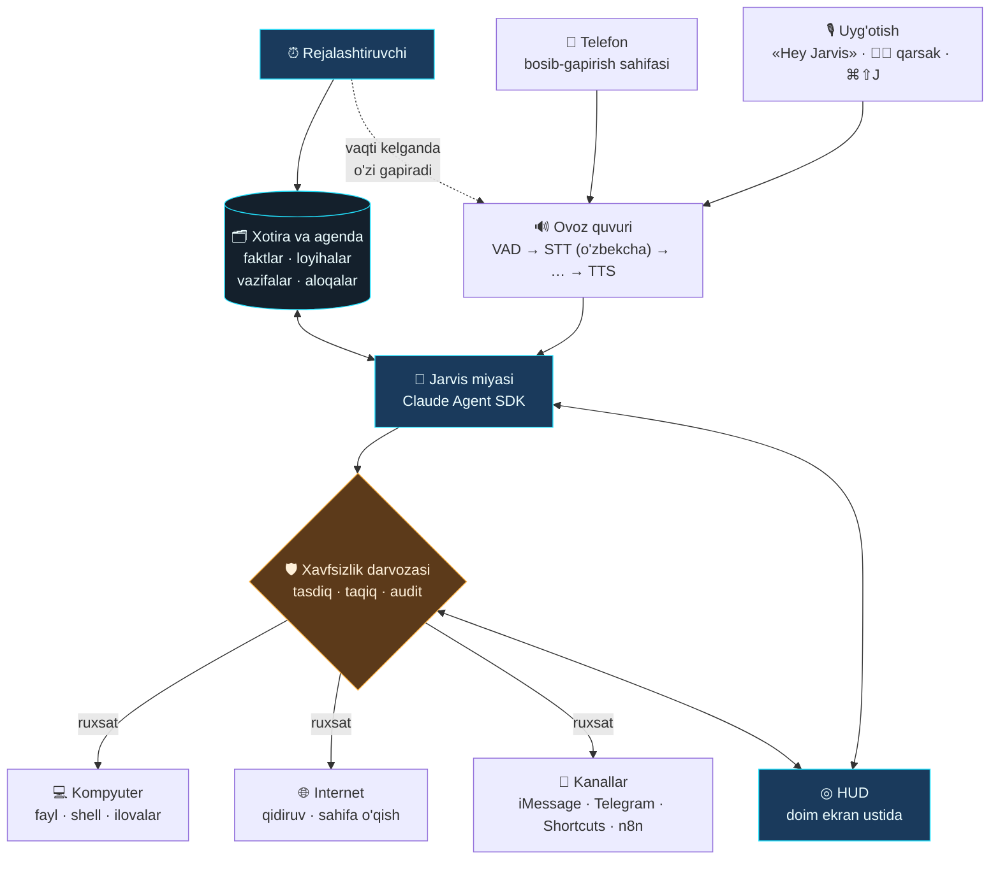

# Jarvis

Ovoz bilan boshqariladigan shaxsiy AI yordamchi — **o'zbek tilida**, macOS uchun.

«Hey Jarvis» deysiz yoki ikki marta qarsak chalasiz — ekranda HUD yonadi,
Jarvis sizni tinglaydi va kompyuterda ish bajaradi. Telegram bot emas, chat oynasi
emas — Siri kabi, lekin butunlay sizniki va kompyuteringizni haqiqatan boshqaradi.



## Nima qila oladi

- **Ovoz bilan uyg'onadi** — «Hey Jarvis», ikki marta qarsak, yoki `⌘⇧J`.
  Qarsak bilan chaqirsangiz «Buyrug'ingizni kutyapman» deydi.
- **O'zbekcha gapiradi va tushunadi** — savol ham, javob ham o'zbek tilida.
- **Kompyuterni boshqaradi** — fayl o'qiydi/yozadi, shell buyruqlarini bajaradi,
  ilovalarni ochadi, kod yozadi, loyihani davom ettiradi.
- **Loyihalaringizni yuritadi** — har bir loyihaning holati, keyingi qadami va
  muddati saqlanadi. «Loyihalarim qaysi bosqichda?» deb so'rasangiz, aytadi.
- **O'zi eslatadi** — «ertaga soat 10 da Alisher bilan uchrashuv» desangiz,
  ertaga soat 10 da **o'zi gapiradi**. So'rashingiz shart emas.
- **Ertalab kunni tushuntiradi** — belgilangan vaqtda bugungi ishlarni aytib beradi.
- **Sizning nomingizdan yozadi** — «Alisherga yoz, kechikaman de» desangiz,
  Telegram yoki SMS orqali yuboradi.
- **Telefonda ham ishlaydi** — telefon brauzeridan bosib-gapirish sahifasi.
- **Har bir xavfli amal uchun so'raydi** — HUD'da ✅/❌ chiqadi, hammasi jurnalga yoziladi.

## Tez boshlash

```bash
git clone https://github.com/kamolbeek/jarvis-assistant.git
cd jarvis-assistant
./scripts/install.sh
```

Keyin `.env` faylini to'ldiring:

```bash
ANTHROPIC_API_KEY=sk-ant-...      # miya
ELEVENLABS_API_KEY=...            # ovoz (STT + TTS)
```

### Nega kalit kerak — va qachon kerak emas

**Miya (Claude)** Anthropic serverlarida ishlaydi, kompyuteringizda emas — model
o'nlab gigabayt va kuchli videokarta talab qiladi. Shuning uchun kirish kaliti
kerak. Ikki yo'l bor:

1. **API kaliti** — har so'rov uchun to'lov ([console.anthropic.com](https://console.anthropic.com)).
2. **Claude Code obunasi** — agar sizda Claude Pro/Max obunasi bo'lsa,
   Mac'da `claude` o'rnatib kiring (`claude` deb yozing, brauzerda tasdiqlang).
   Claude Agent SDK ichida aynan Claude Code'ni ishlatadi, shuning uchun
   `ANTHROPIC_API_KEY` ni umuman qo'ymasangiz ham ishlashi mumkin —
   `python -m jarvis doctor` buni aniq aytadi.

**Ovoz esa butunlay kompyuteringizda ishlashi mumkin** — kalitsiz, internetsiz,
bepul. `config/jarvis.yaml` da:

```yaml
voice:
  stt:
    provider: "whisper_local"     # Whisper Mac'ning o'zida ishlaydi
  tts:
    provider: "macos"             # macOS ning o'z ovozi
```

Kamchiligi — o'zbekcha aniqligi ElevenLabs'dan pastroq va birinchi ishga
tushirishda model yuklab olinadi (~1.5 GB). Lekin hech qanday to'lov yo'q.

macOS ruxsatlarini bering — **Tizim sozlamalari → Maxfiylik va xavfsizlik**:

| Ruxsat | Nima uchun |
| --- | --- |
| Mikrofon | uyg'otuvchi so'z va sizning gapingiz |
| Kirish imkoni (Accessibility) | global tugma, ilovalarni boshqarish |
| Avtomatlashtirish (Automation) | Messages, System Events |

**Ishga tushirishdan oldin — diagnostika.** Birinchi marta hamma narsa birdan
ishlashi kamdan-kam bo'ladi, shuning uchun har bir bo'g'inni alohida tekshiring:

```bash
source .venv/bin/activate
python -m jarvis doctor
```

Ketma-ket tekshiradi: kalitlar → audio qurilmalar → mikrofon (3 soniya gapirasiz,
darajani ko'rsatadi) → uyg'otuvchi so'z modeli → o'sha yozuvni matnga aylantirish →
ovoz chiqarish → Claude. Nima ishlamasa, aynan o'sha qatorda sababi yoziladi.

Hammasi yashil bo'lgach:

```bash
./scripts/run.sh
```

HUD ekranning o'ng pastida paydo bo'ladi. «Hey Jarvis» deb ko'ring.

> HUD'ni Jarvis'ni o'rnatmasdan ham ko'rish mumkin: `docs/orb-demo.html` ni
> brauzerda oching — barcha holatlar, bo'g'inlarni «buzib» ko'rish va to'liq
> suhbat oqimi bor.

### Ish stoli rejimi

Jarvis endi butun ish stolini egallaydi — Rainmeter uslubidagi to'liq HUD,
oynalar ORQASIDA (ish stoli darajasida) turadi:

- **Markazda zirh chizmasi** — «Hey Jarvis» deganingizda ko'zlari yonadi,
  reaktori kuchayadi, orqasidagi halqalar tezlashadi.
- **Chapda ilovalar paneli** — Finder, Safari, Terminal va boshqalar; bosilsa ochiladi.
- **Tizim bloki** — ish vaqti, CPU, xotira, disk (jonli, har 2 soniyada).
- **O'ngda sariq ovoz datchigi** — gapirganingizda ustunlar ko'tarilib tushadi.
- **Dumaloq o'lchagich** — CPU/RAM/disk yoylari.
- **Ob-havo** — bugun/ertaga (open-meteo, kalitsiz; `JARVIS_LAT`/`JARVIS_LON`).
- **Soat, sana, hafta kunlari, papkalar, tezkor havolalar** — hammasi jonli.
- **Chap pastda dumaloq JARVIS** — bosilsa bo'g'in siferblatlari paneli ochiladi.

**Standart fon — SHIELD OS wallpaperi.** Mashhur Iron Man HUD wallpaperi
(`ui/renderer/assets/markaz.jpg`, MIT litsenziyali ochiq repodan) o'rnatilgan
holda keladi va butun ekranni egallaydi. Uning ustida hammasi jonli:

- «Hey Jarvis» deganingizda **Iron Man'ning ko'zlari yonadi**, ko'kragidagi
  reaktor kuchayib aylanadi;
- rasmdagi ilova tugmalari, saytlar ro'yxati va papkalar **haqiqatan bosiladi**
  (Safari, Sozlamalar, YouTube, Yuklamalar...);
- reaktorga bossangiz — Jarvis uyg'onadi;
- chap pastdagi JARVIS doirasiga bossangiz — bo'g'in siferblatlari ochiladi;
- o'ng chetda sariq ovoz datchigi, pastda jonli soat va CPU/RAM/disk.

**Boshqa rasm qo'yish.** Istalgan rasmni HUD ustiga sudrab tashlang — saqlanadi
va uch bosishda sozlanadi (chap ko'z, o'ng ko'z, reaktor).

O'chirish: `JARVIS_DESKTOP=0 ./scripts/run.sh`. Kichik burchak-vidjet har doim qoladi.

### HUD nimani ko'rsatadi

Markazda JARVIS yozuvi — asosiy ikonka. «Hey Jarvis» deganingizda u yorqin
oq bo'lib chaqnaydi, yadro halqalari kengayadi.

Atrofida to'qqizta siferblat, har biri bitta bo'g'inga bog'langan: mikrofon,
uyg'otish, nutq, miya, ovoz, xotira, reja, asbob, tarmoq. Ular shunchaki
bezak emas:

| Ko'rinishi | Ma'nosi |
|---|---|
| Siyon, sekin aylanadi | tayyor, kutmoqda |
| Oq, tez aylanadi | ayni damda ish bajaryapti |
| Sariq | ishlaydi, lekin e'tibor talab qiladi |
| Qizil, X belgisi, to'xtagan | buzilgan |

Bitta bo'g'in buzilsa, HUD chekkasi ham qizg'ish tus oladi. Siferblat ustiga
sichqonchani olib borsangiz, sabab yoziladi — jurnal titkilash shart emas.

Butun ranglar tizimi bitta joyda: `ui/renderer/palette.js`.

## Telefonda ishlatish

Boshidan aniq aytish kerak: **iPhone'da fon rejimida «Hey Jarvis» deb uyg'otish
mumkin emas.** Apple doim tinglash imkonini faqat Siri'ga bergan — hech qanday
uchinchi tomon ilovasi buni qila olmaydi. Bu Jarvis'ning kamchiligi emas,
iOS'ning chegarasi.

Shuning uchun telefonda uchta haqiqiy yo'l bor, va ular birga yaxshi ishlaydi:

**1. Bosib-gapirish sahifasi (asosiy yo'l).** Yadro telefon uchun sahifani o'zi
tarqatadi. Telefon brauzerida ochasiz, orbni bosasiz, gapirasiz — javob o'sha
telefonga ovoz bilan qaytadi. Ilova o'rnatish shart emas; sahifani "Home Screen"
ga qo'shsangiz, oddiy ilovadek ko'rinadi.

```yaml
# config/jarvis.yaml
ui:
  host: "0.0.0.0"                 # tarmoqdagi qurilmalar uchun
  token: "bu-yerga-tasodifiy-satr"  # openssl rand -hex 16
```

Jarvis ishga tushganda terminalda manzilni yozadi — telefonda o'shani oching.

> **Nega token majburiy?** `0.0.0.0` — bu "bir WiFi'dagi hamma ulanishi mumkin"
> degani. Tokensiz qo'shni ham sizning kompyuteringizda buyruq bajarardi.
> Token bo'lmasa Jarvis ishga tushmaydi va buni aytadi.

Uydan tashqarida ishlatish uchun **Tailscale** qo'ying (bepul) — telefoningiz
va kompyuteringiz qayerda bo'lsa ham bitta xususiy tarmoqda bo'ladi.
Portni internetga to'g'ridan-to'g'ri ochmang.

**2. Siri qisqa yo'li.** Shortcuts'da "Jarvis" nomli qisqa yo'l yarating,
u sahifani ochsin. Shunda «Hey Siri, Jarvis» deysiz — bir so'z ko'p, lekin
telefonni qo'lga olmasdan ishlaydi.

**3. Telegram ovozli xabar.** Kompyuter o'chiq bo'lsa ham ishlaydigan yagona
yo'l — Jarvis keyin o'qiydi va bajaradi.

## O'zbekcha uyg'otuvchi so'z: «Salom Jarvis»

Hozir standart model — inglizcha talaffuzdagi **«hey jarvis»** (openWakeWord'da
tayyor keladi). «Salom Jarvis» yoki o'zbekcha talaffuzdagi «hey Jarvis» uchun
o'z modelingizni o'rgatish kerak. Bu bir martalik ish va bepul:

1. openWakeWord'ning tayyor daftarida (`automatic_model_training.ipynb`,
   Google Colab'da bepul ishlaydi) iborani kiriting: `salom jarvis`.
2. U sintetik ovozlar bilan ma'lumot yaratib, `.onnx` model chiqaradi.
3. Modelni `~/.jarvis/wakewords/` ga qo'ying va konfiguratsiyada ko'rsating:

```yaml
activation:
  wake_word:
    model: "salom_jarvis"
    threshold: 0.45
```

Ancha tezroq muqobil: **Picovoice Porcupine** — veb-interfeysida istalgan
iborani yozib, bir necha daqiqada model olasiz. Bepul tier shaxsiy foydalanish
uchun yetarli. `backend: "porcupine"` qiling va `PICOVOICE_ACCESS_KEY` qo'ying.

## Uzoq masofadan chaqirish

Xonaning narigi burchagidan chaqirmoqchi bo'lsangiz:

```yaml
audio:
  input_gain: 3.0        # kirish signalini kuchaytirish
activation:
  wake_word:
    threshold: 0.35      # sezgirroq (standart 0.5)
```

Kuchaytirish shovqinni ham kuchaytiradi — yolg'on ishga tushish ko'paysa,
qiymatlarni qaytaring. Rostini aytganda, eng katta farqni yaxshi mikrofon
beradi: MacBook'ning ichki mikrofoni 1–2 metrgacha yaxshi ishlaydi, undan
narisiga tashqi mikrofon kerak.

## O'zbek tili uchun ovoz: qaysi provayderni tanlash

Bu loyihaning eng nozik qismi — o'zbekcha sifat provayderdan provayderga
sezilarli farq qiladi. Shuning uchun provayderlar almashtiriladigan qilingan:
`config/jarvis.yaml` da bir qator o'zgartirsangiz kifoya.

| Provayder | STT | TTS | Izoh |
| --- | :---: | :---: | --- |
| **ElevenLabs** | ✅ Scribe | ✅ multilingual v2 | Standart tanlov. Bitta kalit bilan ikkalasi ham ishlaydi. |
| **Mohir.ai** (UzbekVoice) | ✅ | ✅ | Aynan o'zbek tiliga o'rgatilgan, mahalliy. Aksentda aniqroq bo'lishi mumkin. |
| **Azure Speech** | — | ✅ `uz-UZ-SardorNeural`, `uz-UZ-MadinaNeural` | Haqiqiy o'zbekcha neyron ovozlar. |
| **Whisper (lokal)** | ✅ | — | Internetsiz ishlaydi. Apple Silicon'da MLX orqali tez. |

**Tavsiya:** ElevenLabs bilan boshlang, keyin o'z ovozingizda uch variantni
solishtiring. Ovoz sifati — bu tizimda foydalanish tajribasini eng ko'p
belgilaydigan omil.

```yaml
# config/jarvis.yaml
voice:
  stt:
    provider: "mohir"          # elevenlabs | mohir | whisper_local
  tts:
    provider: "azure"          # elevenlabs | azure | mohir | macos
    voice: "uz-UZ-SardorNeural"
```

## Xavfsizlik — eng muhim qism

«Mensiz to'liq nazorat» — bu tizimning eng xavfli tomoni. Agent `rm -rf` yozsa
yoki ma'lumotlar bazasida noto'g'ri `UPDATE` bajarsa, uni kim to'xtatadi?

Shuning uchun har bir asbob chaqiruvi xavfsizlik darvozasidan o'tadi:

```yaml
safety:
  default: "ask"
  rules:
    Read: "allow"       # o'qish — qaytarib bo'ladi, so'ralmaydi
    Bash: "ask"         # shell — har safar tasdiq
    Write: "ask"        # fayl yozish — tasdiq
  forbidden_patterns:   # bular umuman bajarilmaydi
    - "rm -rf /"
    - "sudo rm"
  writable_roots:       # bulardan tashqariga yozib bo'lmaydi
    - "~/jarvis-workspace"
```

Uch qatlam:

1. **Taqiqlangan naqshlar** — tasdiq ham so'ralmaydi, shunchaki bajarilmaydi.
2. **Papka chegarasi** — ruxsat etilgan papkalardan tashqariga yozish bloklanadi
   (shell `>` yo'naltirishlari ham tekshiriladi).
3. **Tasdiq** — qolgan xavfli amallar HUD'da ✅/❌ bo'lib chiqadi.

Hammasi `~/.jarvis/audit.log` ga yoziladi. **Boshidan to'liq erkinlik bermang** —
ishonch ortgan sari qoidalarni yumshating.

## Halol cheklovlar

Buni oldindan bilib qo'ying, keyin ko'ngil qolmasin:

**Telefonda «Hey Jarvis» deb fon rejimida uyg'otib bo'lmaydi.** Apple buni faqat
Siri'ga ruxsat bergan. Yuqoridagi uchta yo'l — sahifa, Siri qisqa yo'li, Telegram —
mavjud eng yaxshi variantlar.

**iPhone'ni to'liq boshqarib bo'lmaydi.** Shortcuts orqali cheklangan ishlar mumkin
(eslatma, xabar, joylashuv), lekin «telefonimni to'liq boshqar» degani iOS'da yo'q.
Android'da ADB va Tasker bilan ancha ko'p narsa mumkin.

**Kompyuter yoqiq bo'lishi kerak.** Jarvis lokal ishlaydi — uxlab qolgan mashinada
ishlamaydi, eslatmalar ham aytilmaydi (uyg'onganda aytiladi). Uxlashini
to'xtatish uchun: Tizim sozlamalari → Batareya → "Prevent automatic sleeping".
Doimiy ishlashi kerak bo'lgan ishlarni VPS'dagi n8n'ga o'tkazing va `call_n8n`
orqali ulang.

**Ovoz kechikishi bor.** Uyg'onishdan javobgacha odatda 2–4 soniya: gapirish
tugashini kutish, STT, model, TTS. Javob gap-gap chiqariladi, shuning uchun
birinchi so'z tezroq eshitiladi — lekin bu Siri emas.

**O'zbekcha STT mukammal emas.** Texnik atamalar, ingliz so'zlari va tez gapirish
xatolarga olib keladi. Muhim buyruqlarni sekinroq va aniq ayting.

**Xarajat.** Claude API ishlatilishiga qarab ~$20–60/oy, ElevenLabs alohida.
`brain.max_budget_usd` bilan har bir suhbatga chegara qo'ying.

## Loyiha tuzilishi

```
jarvis/
├── audio/          mikrofon, uyg'otuvchi so'z, qarsak, gapirish tugashi (VAD)
├── voice/          STT va TTS provayderlari + ijro
├── brain/
│   ├── agent.py    Claude Agent SDK ustidagi qatlam
│   ├── agenda.py   loyihalar, vazifalar, aloqalar
│   ├── memory.py   barqaror faktlar va suhbatlar
│   └── prompts.py  o'zbekcha tizim ko'rsatmasi
├── safety/         xavfsizlik darvozasi va audit
├── tools/          xotira, agenda, macOS, Telegram, Shortcuts asboblari
├── ui/             orb va telefon uchun HTTP + WebSocket server
├── scheduler.py    vaqti kelgan ishlarni o'zi aytadi
├── bus.py          hodisa shinasi
├── health.py       bo'g'inlar tirikligi — HUD siferblatlari shundan
├── doctor.py       diagnostika (`jarvis doctor`)
└── __main__.py     asosiy sikl

ui/
├── main.js         Electron oynasi
└── renderer/
    ├── palette.js  ranglar — yagona manba
    ├── hud.js      HUD chizuvchisi (siferblatlar, yadro, yozuv)
    ├── orb.js      yadro bilan aloqa va kadrlar sikli
    └── phone.html  telefon sahifasi (bitta faylda)
```

Testlar API kaliti va mikrofon talab qilmaydi:

```bash
python -m pytest tests/ -q
```

## Misollar

Ovoz bilan aytishingiz mumkin:

| Siz aytasiz | Jarvis nima qiladi |
| --- | --- |
| «Ertaga soat 10 da Alisher bilan uchrashuv» | vazifa yozadi va **ertaga soat 10 da o'zi eslatadi** |
| «Har kuni ertalab 9 da iLevel hisobotini tekshir» | takrorlanuvchi vazifa yaratadi |
| «Loyihalarim qaysi bosqichda?» | har birining holati va keyingi qadamini aytadi |
| «iLevel loyihasi test bosqichida, keyingi qadam — deploy» | loyiha holatini yangilaydi |
| «Alisherga yoz, kechikaman de» | aloqani topib, Telegram/SMS yuboradi |
| «Bugun nima ishlarim bor?» | kunlik ro'yxatni aytadi |
| «Shu papkadagi kodni ko'r va testlarni ishga tushir» | o'qiydi, bajaradi, natijani aytadi |

## Keyingi bosqichlar

- [ ] Uzluksiz suhbat rejimi — har safar «Hey Jarvis» demasdan davom ettirish
- [ ] Jarvis gapirayotganda uni bo'lish (barge-in)
- [ ] Tayyor o'zbekcha uyg'otuvchi so'z modeli («Salom Jarvis») repoda
- [ ] Brauzer boshqaruvi (Playwright)
- [ ] Kalendar integratsiyasi (Google Calendar / Apple Calendar)
- [ ] Supabase orqali xotirani qurilmalar o'rtasida sinxronlash
